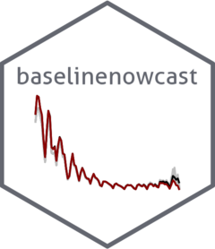

<!-- README.md is generated from README.Rmd. Please edit that file -->

# Baseline nowcast <a href="https://baselinenowcast.epinowcast.org/"></a>

<!-- badges: start -->

[](https://lifecycle.r-lib.org/articles/stages.html#stable)
[](https://github.com/epinowcast/baselinenowcast/actions/workflows/R-CMD-check.yaml)
[](https://app.codecov.io/gh/epinowcast/baselinenowcast)
[](https://github.com/epinowcast/baselinenowcast/blob/master/LICENSE.md/)
[](https://github.com/epinowcast/baselinenowcast/graphs/contributors)
<!-- badges: end -->

## Summary

Nowcasting right-truncated epidemiological data is critical for timely
public health decision-making, as reporting delays can create misleading
impressions of declining trends in recent data. This package provides
nowcasting methods based on using empirical delay distributions and
uncertainty from past performance. It is also designed to be used as a
baseline method for developers of new nowcasting methods. For more
details on the performance of the method(s) in this package applied to
case studies of COVID-19 and norovirus, see our recent paper at
<https://wellcomeopenresearch.org/articles/10-614>. The package supports
standard data frame inputs with reference date, report date, and count
columns, as well as the direct use of reporting triangles, and is
compatible with ‘epinowcast’ objects. Alongside an opinionated default
workflow, it has a low-level pipe-friendly modular interface, allowing
context-specific workflows. It can accommodate a wide spectrum of
reporting schedules, including mixed patterns of reference and reporting
(daily-weekly, weekly-daily). It also supports sharing delay
distributions and uncertainty estimates between strata, as well as
custom uncertainty models and delay estimation methods.

## Installation

<details>
<summary>
Installing the package
</summary>

You can install the latest released version using:

``` r
install.packages("baselinenowcast")
```

Alternatively, you can install the latest GitHub release from our
r-universe repository:

``` r
install.packages("baselinenowcast", repos = "https://epinowcast.r-universe.dev")
```

To install the development version from GitHub, use the [`pak`
package](https://pak.r-lib.org/):

``` r
pak::pak(file.path("epinowcast", "baselinenowcast"))
```

Another option for installation is using the [`remotes`
package](https://CRAN.R-project.org/package=remotes):

``` r
remotes::install_github(file.path("epinowcast", "baselinenowcast"))
```

</details>

## Resources

We provide a range of other documentation, case studies, and community
spaces to ask (and answer!) questions:

<details>
<summary>
Organisation Website
</summary>

Our [organisation website](https://www.epinowcast.org/) includes links
to other resources, [guest posts](https://www.epinowcast.org/blog.html),
and [seminar schedule](https://www.epinowcast.org/seminars.html) for
both upcoming and past recordings.

</details>
<details>
<summary>
Community Forum
</summary>

Our [community forum](https://community.epinowcast.org/) has areas for
[question and answer](https://community.epinowcast.org/c/interface/15)
and [considering new methods and
tools](https://community.epinowcast.org/c/projects/11), among others. If
you are generally interested in real-time analysis of infectious
disease, you may find this useful even if you do not use
`baselinenowcast`.

</details>

## Contributing

We welcome contributions and new contributors! We particularly
appreciate help on [identifying and identified
issues](https://github.com/epinowcast/baselinenowcast/issues). Please
check and add to the issues, and/or add a [pull
request](https://github.com/epinowcast/baselinenowcast/pulls) and see
our [contributing
guide](https://github.com/epinowcast/.github/blob/main/CONTRIBUTING.md)
for more information.

### How to make a bug report or feature request

Please briefly describe your problem and what output you expect in an
[issue](https://github.com/epinowcast/baselinenowcast/issues). See our
[contributing
guide](https://github.com/epinowcast/.github/blob/main/CONTRIBUTING.md)
for more information.

### Code of Conduct

Please note that the `baselinenowcast` project is released with a
[Contributor Code of
Conduct](https://github.com/epinowcast/.github/blob/main/CODE_OF_CONDUCT.md).
By contributing to this project, you agree to abide by its terms.

## Citation

If you use `baselinenowcast` in your work, please consider citing it
with `citation("baselinenowcast")` (or
`print(citation("baselinenowcast"), bibtex = TRUE)`):

    To cite baselinenowcast in publications please use the following.

      Johnson KE, Tang M, Tyszka E, Nemcova B, Wolffram D, Ergas R, Reich
      NG, Funk S, Mellor J, Bracher J, Abbott S (2025). "Baseline
      nowcasting methods for handling delays in epidemiological data."
      _Wellcome Open Research_. doi:10.12688/wellcomeopenres.25027.1
      <https://doi.org/10.12688/wellcomeopenres.25027.1>,
      <https://wellcomeopenresearch.org/articles/10-614>.

    A BibTeX entry for LaTeX users is

      @Article{,
        title = {Baseline nowcasting methods for handling delays in epidemiological data},
        author = {Kaitlyn E. Johnson and Maria Tang and Emily Tyszka and Barbora Nemcova and Daniel Wolffram and Rosa Ergas and Nicholas G. Reich and Sebastian Funk and Jonathon Mellor and Johannes Bracher and Sam Abbott},
        year = {2025},
        journal = {Wellcome Open Research},
        doi = {10.12688/wellcomeopenres.25027.1},
        url = {https://wellcomeopenresearch.org/articles/10-614},
      }

      Johnson KE, Tyszka E, Bracher J, Funk S, Abbott S (2025).
      _baselinenowcast: Methods for baseline nowcasting right-truncated
      epidemiological data_.
      <https://github.com/epinowcast/baselinenowcast/>.

    A BibTeX entry for LaTeX users is

      @Manual{,
        license = {MIT},
        title = {baselinenowcast: Methods for baseline nowcasting right-truncated epidemiological data},
        author = {Kaitlyn E. Johnson and Emily Tyszka and Johannes Bracher and Sebastian Funk and Sam Abbott},
        year = {2025},
        url = {https://github.com/epinowcast/baselinenowcast/},
      }

## Contributors

<!-- ALL-CONTRIBUTORS-LIST:START - Do not remove or modify this section -->
<!-- prettier-ignore-start -->
<!-- markdownlint-disable -->

All contributions to this project are gratefully acknowledged using the
[`allcontributors` package](https://github.com/ropensci/allcontributors)
following the [allcontributors](https://allcontributors.org)
specification. Contributions of any kind are welcome!

### Code

<a href="https://github.com/epinowcast/baselinenowcast/commits?author=kaitejohnson">kaitejohnson</a>,
<a href="https://github.com/epinowcast/baselinenowcast/commits?author=seabbs">seabbs</a>,
<a href="https://github.com/epinowcast/baselinenowcast/commits?author=TimTaylor">TimTaylor</a>,
<a href="https://github.com/epinowcast/baselinenowcast/commits?author=jamesmbaazam">jamesmbaazam</a>,
<a href="https://github.com/epinowcast/baselinenowcast/commits?author=sbfnk">sbfnk</a>

### Issue Authors

<a href="https://github.com/epinowcast/baselinenowcast/issues?q=is%3Aissue+author%3Ajonathonmellor">jonathonmellor</a>,
<a href="https://github.com/epinowcast/baselinenowcast/issues?q=is%3Aissue+author%3Aswo">swo</a>,
<a href="https://github.com/epinowcast/baselinenowcast/issues?q=is%3Aissue+author%3Ajcblemai">jcblemai</a>,
<a href="https://github.com/epinowcast/baselinenowcast/issues?q=is%3Aissue+author%3Alauraajones2">lauraajones2</a>

### Issue Contributors

<a href="https://github.com/epinowcast/baselinenowcast/issues?q=is%3Aissue+commenter%3Ajbracher">jbracher</a>,
<a href="https://github.com/epinowcast/baselinenowcast/issues?q=is%3Aissue+commenter%3ASamuelBrand1">SamuelBrand1</a>

<!-- markdownlint-enable -->
<!-- prettier-ignore-end -->
<!-- ALL-CONTRIBUTORS-LIST:END -->
<!-- will add this in later -->
