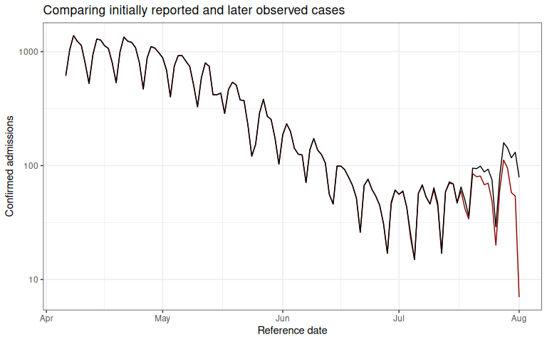
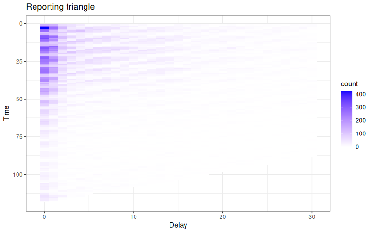
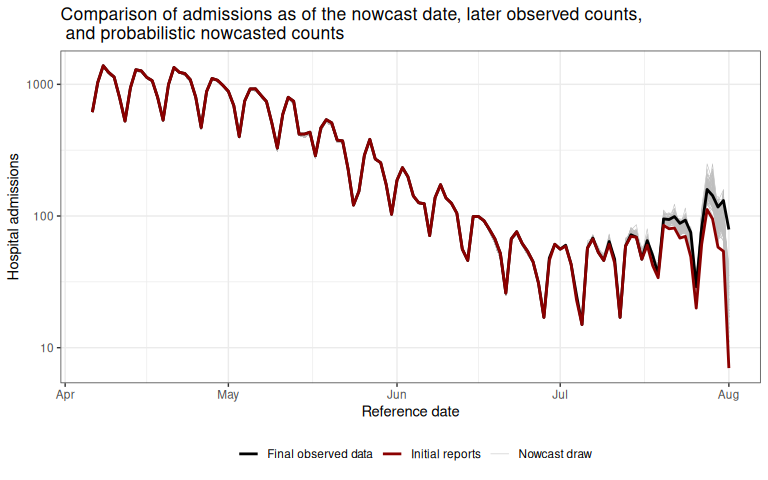

# Getting Started with baselinenowcast

## Introduction

Incomplete reporting of epidemiological data at recent times can result
in case count data that is right-truncated. Right-truncated case counts
can be misleading to interpret at face-value, as they will typically
show a decline in the number of reported observations in the most recent
time points. These are the time points where the highest proportion of
the data has yet to be observed in the dataset.

The imputation of the cases that will eventually be observed up until
the current time is referred to as a nowcast.

A number of methods have been developed to nowcast epidemiological case
count data.

The purpose of `baselinenowcast` is to provide a nowcast computed
directly from the most recent observations to estimate a delay
distribution empirically, and apply that to the partially observed data
to generate a nowcast.

In the below section, we will describe an example of a nowcasting
problem, and demonstrate how to use the
[`baselinenowcast()`](https://baselinenowcast.epinowcast.org/reference/baselinenowcast.md)
function to estimate a delay distribution from the data and apply that
estimate to generate a probabilistic nowcast. This function chains
together a series of nowcasting steps. For an example that walks through
the low-level functionality applied to this same epidemiological
question, see the [modular
workflow](https://baselinenowcast.epinowcast.org/articles/modular_workflow.md)
vignette. In future vignettes, we will demonstrate examples of how to
create more complex model permutations. More details on the mathematical
methods are provided in the [mathematical
model](https://baselinenowcast.epinowcast.org/articles/model_definition.md)
vignette.

## Packages

As well as the `baselinenowcast` package this vignette also uses
`epinowcast`, `ggplot2`, `tidyr`, and `dplyr`. For `baselinenowcast`,
see the [installation
instructions](https://github.com/epinowcast/baselinenowcast#installation).

Code

``` r
knitr::opts_chunk$set(
  collapse = TRUE,
  comment = "#>"
)
library(baselinenowcast)
library(ggplot2)
library(dplyr)
library(tidyr)
```

## Data

Nowcasting of right-truncated case counts involves the estimation of
reporting delays for recently reported data. For this, we need case
counts indexed both by when they were diagnosed (often called the
“reference date”) and by when they were reported (i.e. when
administratively recorded via public health surveillance; often called
“report date”). The difference between the reference date and the report
date is the reporting delay. For this quick start, we use daily level
data from the [Robert Koch Institute via the Germany Nowcasting
hub](https://github.com/KITmetricslab/hospitalization-nowcast-hub/wiki/Truth-data#role-an-definition-of-the-seven-day-hospitalization-incidence).
These data represent hospital admission counts by date of positive test
and date of test report in Germany up to October 1, 2021.

We will filter the data to just look at the national-level data, for all
age groups. We will pretend that we are making a nowcast as of August 1,
2021, therefore we will exclude all reference dates and report dates
from before that date. `germany_covid19_hosp` is provided as package
data, see
[`?germany_covid19_hosp`](https://baselinenowcast.epinowcast.org/reference/germany_covid19_hosp.md)
for details. In this example, we will focus on the cases for all of
Germany (“DE”) summed across all age groups (“00+”). We’ll start by
preparing the data for nowcasting and evaluation by removing all
reference dates beyond the nowcast date and report dates beyond the date
we will use to evaluate our nowcast performance.

Code

``` r
nowcast_date <- "2021-08-01"
eval_date <- "2021-10-01"

target_data <- filter(
  germany_covid19_hosp,
  location == "DE", age_group == "00+",
  report_date <= eval_date,
  reference_date <= nowcast_date
)
```

Next we can plot both the “initial reports” by taking the sum of the
cases at each reference date excluding all reports after the nowcast
date, and compare that to what we will eventually observe as of the
latest date in the complete dataset (data available through October 1,
2021). Let’s first take the sum of the cases at each reference date from
the complete dataset, which represents the “final” case counts using the
data available through October 1, 2021.

Code

``` r
latest_data <- target_data |>
  group_by(reference_date) |>
  summarise(final_count = sum(count))
```

Next, let’s get a dataset of what we would have had available as of the
nowcast date, which we obtain by excluding all report dates after the
nowcast date.

Code

``` r
observed_data <- filter(
  target_data,
  report_date <= nowcast_date
)

head(observed_data)
#> # A tibble: 6 × 6
#>   reference_date location age_group delay count report_date
#>   <date>         <chr>    <chr>     <int> <dbl> <date>     
#> 1 2021-04-06     DE       00+           0   149 2021-04-06 
#> 2 2021-04-06     DE       00+           1   140 2021-04-07 
#> 3 2021-04-06     DE       00+           2    61 2021-04-08 
#> 4 2021-04-06     DE       00+           3    52 2021-04-09 
#> 5 2021-04-06     DE       00+           4    36 2021-04-10 
#> 6 2021-04-06     DE       00+           5     8 2021-04-11
```

We refer to the “initial reports” as the sum of the cases at each
reference date as they were available as of the nowcast date.

Code

``` r
initial_reports <- observed_data |>
  group_by(reference_date) |>
  summarise(initial_count = sum(count))
```

We will make a plot comparing the initial reports to the later observed
final number of confirmed cases at each reference date.

Click to expand code to create the plot of the latest data

Code

``` r
plot_data <- ggplot() +
  geom_line(
    data = initial_reports,
    aes(x = reference_date, y = initial_count), color = "darkred"
  ) +
  geom_line(
    data = latest_data,
    aes(x = reference_date, y = final_count), color = "black"
  ) +
  theme_bw() +
  xlab("Reference date") +
  ylab("Confirmed admissions") +
  scale_y_continuous(trans = "log10") +
  ggtitle("Comparing initially reported and later observed cases")
```

Code

``` r
plot_data
```



The red line shows the total number of confirmed admissions on each
reference date, across all delays, using the data available as of August
1, 2021. It demonstrates the characteristic behaviour of
right-truncation. This is because we have not yet observed the data with
longer delays at recent time points. The black line shows the total
number of confirmed admissions on each reference date as of October 1,
2021.

Our task will be to estimate, from the data available up until August 1,
2021, the “final” number of cases at each reference date.

## Pre-processing

In order to compute a nowcast for this data, we will need to start by
creating what we call a reporting triangle. See the
[nomenclature](https://baselinenowcast.epinowcast.org/articles/nomenclature.md)
vignette for more details on the structure and naming of different
components used in the package.

The entries in the reporting triangle represent the number of new cases
assigned to that reference time point with a particular delay, with
entries in the bottom right of the triangle missing as the data reported
with longer delays has yet to be observed for recent reference times.
The reporting triangle will be used to estimate the delay distribution,
or the proportion of the final number of cases reported on a particular
delay.

In this example, we will both fit our delay distribution, and apply it
to generate a nowcast matrix using the same data, the national level
data from Germany for all age groups.

We recommend choosing the maximum delay and number of historical
observations based on an exploratory data analysis, as these
specifications will change significantly depending on the dataset. See
the [NSSP
nowcast](https://baselinenowcast.epinowcast.org/articles/nssp_nowcast.md)
for an example of an exploratory data analysis used to identify the
maximum delay. Here we will set the maximum delay to 30 days.

Empirical data outside this delay window will not be used for training.

Code

``` r
max_delay <- 30
```

Next, we will specify the amount of training volume used to fit the
model as a function of the maximum delay, and the proportion of the
total training volume used for delay estimation (with the remainder
being used for uncertainty estimation). Internally within
[`baselinenowcast()`](https://baselinenowcast.epinowcast.org/reference/baselinenowcast.md)
we will call,
[`allocate_reference_times()`](https://baselinenowcast.epinowcast.org/reference/allocate_reference_times.md)
with these arguments. We’ll us the default settings for this function
here, which uses 3 times the maximum delay for the total training volume
with 50% used for delay estimation.

Code

``` r
scale_factor <- 3
prop_delay <- 0.5
```

Next we obtain a `reporting_triangle` using the
[`as_reporting_triangle()`](https://baselinenowcast.epinowcast.org/reference/as_reporting_triangle.md)
function, which expects a data.frame with case counts indexed by
reference date and report date. This function computes the delay between
the reference and report date and pivots the data from long to wide, so
that the rows are reference times and the columns indicate the delay
between the reference and report date, and the entries indicate the
incident case counts. This also validates that the data is in the
correct format and runs pre-processing to fill in any missing dates, see
[`?as_reporting_triangle.data.frame`](https://baselinenowcast.epinowcast.org/reference/as_reporting_triangle.data.frame.md)
and
[`?reporting_triangle`](https://baselinenowcast.epinowcast.org/reference/reporting_triangle-class.md)
for more details on required inputs and the format of the
`reporting_triangle` object.

Code

``` r
rep_tri_full <- as_reporting_triangle(observed_data)
#> ℹ Using max_delay = 40 from data
```

Let’s look at the reporting triangle object we’ve created:

Code

``` r
rep_tri_full
#> Reporting Triangle
#> Delays unit: days
#> Reference dates: 2021-04-06 to 2021-08-01
#> Max delay: 40
#> Structure: 1
#> 
#> Showing last 10 of 118 rows
#> Showing first 10 of 41 columns
#> 
#>             0  1  2  3  4  5  6  7  8  9
#> 2021-07-23 30 12  4  1 10  6  0  2  2  1
#> 2021-07-24 31  8  4  9  8  2  5  2  1 NA
#> 2021-07-25  8  4 14  8  6  5  1  3 NA NA
#> 2021-07-26  9  6  2  3  0  0  0 NA NA NA
#> 2021-07-27 35 11  6  4  4  1 NA NA NA NA
#> 2021-07-28 51 28 25  3  5 NA NA NA NA NA
#> 2021-07-29 47 37  9  2 NA NA NA NA NA NA
#> 2021-07-30 36 20  2 NA NA NA NA NA NA NA
#> 2021-07-31 38 16 NA NA NA NA NA NA NA NA
#> 2021-08-01  7 NA NA NA NA NA NA NA NA NA
#> 
#> Use print(x, n_rows = NULL, n_cols = NULL) to see all data
```

And we can get a summary of it:

Code

``` r
summary(rep_tri_full)
#> Reporting Triangle Summary
#> Dimensions: 118 x 41
#> Reference period: 2021-04-06 to 2021-08-01
#> Max delay: 40 days
#> Structure: 1
#> Most recent complete date: 2021-06-22 (67 cases)
#> Dates requiring nowcast: 40 (complete: 78)
#> Rows with negatives: 0
#> Zeros: 1278 (31.8% of non-NA values)
#> Zeros per row summary:
#>    Min. 1st Qu.  Median    Mean 3rd Qu.    Max. 
#>    0.00    4.00    8.00   10.83   19.00   33.00
#> 
#> Mean delay summary (complete rows):
#>    Min. 1st Qu.  Median    Mean 3rd Qu.    Max. 
#>   2.525   4.857   5.650   5.469   6.174   7.678
#> 
#> 99% quantile delay (complete rows):
#>    Min. 1st Qu.  Median    Mean 3rd Qu.    Max. 
#>   17.00   33.00   35.00   34.31   37.00   40.00
```

We can see the maximum delay is set to the maximum observed delay, which
in some cases will be a lot larger than the delays we want to model. We
strongly recommend using the
[`truncate_to_delay()`](https://baselinenowcast.epinowcast.org/reference/truncate_to_delay.md)
or
[`truncate_to_quantile()`](https://baselinenowcast.epinowcast.org/reference/truncate_to_quantile.md)
functions to set the maximum delay in your nowcasting problem. Choosing
too large a maximum delay will mean that there is less data, or
potentially insufficient data, available for estimating uncertainty from
retrospective nowcast errors. For this analysis, we want to limit our
reporting triangle to a maximum delay of 30 days using
[`truncate_to_delay()`](https://baselinenowcast.epinowcast.org/reference/truncate_to_delay.md):

Code

``` r
rep_tri <- truncate_to_delay(rep_tri_full, max_delay = max_delay)
#> ℹ Truncating from max_delay = 40 to 30.
```

Let’s check the truncated triangle:

Code

``` r
rep_tri
#> Reporting Triangle
#> Delays unit: days
#> Reference dates: 2021-04-06 to 2021-08-01
#> Max delay: 30
#> Structure: 1
#> 
#> Showing last 10 of 118 rows
#> Showing first 10 of 31 columns
#> 
#>             0  1  2  3  4  5  6  7  8  9
#> 2021-07-23 30 12  4  1 10  6  0  2  2  1
#> 2021-07-24 31  8  4  9  8  2  5  2  1 NA
#> 2021-07-25  8  4 14  8  6  5  1  3 NA NA
#> 2021-07-26  9  6  2  3  0  0  0 NA NA NA
#> 2021-07-27 35 11  6  4  4  1 NA NA NA NA
#> 2021-07-28 51 28 25  3  5 NA NA NA NA NA
#> 2021-07-29 47 37  9  2 NA NA NA NA NA NA
#> 2021-07-30 36 20  2 NA NA NA NA NA NA NA
#> 2021-07-31 38 16 NA NA NA NA NA NA NA NA
#> 2021-08-01  7 NA NA NA NA NA NA NA NA NA
#> 
#> Use print(x, n_rows = NULL, n_cols = NULL) to see all data
```

Click to expand code to create the plot of the reporting triangle

Code

``` r
triangle_df <- as.data.frame(rep_tri) |>
  mutate(time = as.numeric(factor(reference_date)))

plot_triangle <- ggplot(
  triangle_df,
  aes(x = delay, y = time, fill = count)
) +
  geom_tile() +
  scale_fill_gradient(low = "white", high = "blue") +
  labs(title = "Reporting triangle", x = "Delay", y = "Time") +
  theme_bw() +
  scale_y_reverse()
```

Code

``` r
plot_triangle
```

 Here, the
grey indicates matrix elements that are `NA`, which we would expect to
be the case in the bottom right portion of the reporting triangle where
the counts have yet to be observed.

## Run the `baselinenowcast` workflow

To generate a nowcast from a reporting triangle, we can use the
[`baselinenowcast()`](https://baselinenowcast.epinowcast.org/reference/baselinenowcast.md)
function. This function chains together the following nowcasting
steps: 1. Allocates the reference times
([`allocate_reference_times()`](https://baselinenowcast.epinowcast.org/reference/allocate_reference_times.md))
used for model fitting for both delay and uncertainty estimation, given
the `scale_factor` and `prop_delay` as described above, with the values
above also used as defaults in the absence of user specification. 2.
Estimates a delay distribution from the reporting triangle
([`estimate_delay()`](https://baselinenowcast.epinowcast.org/reference/estimate_delay.md)),
using the number of reference times allocated for delay estimation. 3.
Generates a point nowcast
([`apply_delay()`](https://baselinenowcast.epinowcast.org/reference/apply_delay.md))
from the reporting triangle and delay distribution. 4. Estimates the
uncertainty parameters
([`estimate_uncertainty_retro()`](https://baselinenowcast.epinowcast.org/reference/estimate_uncertainty_retro.md))
using retrospective nowcast errors. 5. Sample from the uncertainty model
to generate probabilistic draws of the nowcast
([`sample_nowcasts()`](https://baselinenowcast.epinowcast.org/reference/sample_nowcasts.md)).

See the documentation for each of these functions for more details on
the specific workflow step, and the documentation for
[`?baselinenowcast.reporting_triangle`](https://baselinenowcast.epinowcast.org/reference/baselinenowcast.reporting_triangle.md)
for input options. In this example, we will demonstrate how to specify
the reference time allocation and the number of probabilistic draws to
include, and will otherwise use the default specifications. A point
nowcast can be returned by specifying `output_type = "point"`.

Code

``` r
nowcast_draws_df <- baselinenowcast(
  rep_tri,
  scale_factor = scale_factor,
  prop_delay = prop_delay,
  draws = 100
)
```

The `nowcast_draws_df` is a data.frame of the class `baselinenowcast_df`
(see
[`?baselinenowcast_df`](https://baselinenowcast.epinowcast.org/reference/baselinenowcast_df-class.md)
for more details). It contains probabilistic draws of estimate of the
final number of cases on each reference date.

## Visualizing the nowcast

We’ll want to compare the nowcasts to both the initial reports and the
eventually observed case counts. We can join both datasets to the
probabilistic nowcasts by the reference date. Join the nowcasts, data as
of the nowcast date, and the final data.

Code

``` r
obs_with_nowcast_draws_df <- nowcast_draws_df |>
  left_join(latest_data, by = "reference_date") |>
  left_join(initial_reports, by = "reference_date")
head(obs_with_nowcast_draws_df)
#>   pred_count reference_date draw output_type final_count initial_count
#> 1        609     2021-04-06    1     samples         615           615
#> 2        609     2021-04-06    2     samples         615           615
#> 3        609     2021-04-06    3     samples         615           615
#> 4        609     2021-04-06    4     samples         615           615
#> 5        609     2021-04-06    5     samples         615           615
#> 6        609     2021-04-06    6     samples         615           615
```

Click to expand code to create the plot of the probabilistic nowcast

Code

``` r
combined_data <- obs_with_nowcast_draws_df |>
  select(reference_date, initial_count, final_count) |>
  distinct() |>
  pivot_longer(
    cols = c(initial_count, final_count),
    names_to = "type",
    values_to = "count"
  ) |>
  mutate(type = case_when(
    type == "initial_count" ~ "Initial reports",
    type == "final_count" ~ "Final observed data"
  ))

# Plot with draws for nowcast only
plot_prob_nowcast <- ggplot() +
  # Add nowcast draws as thin gray lines
  geom_line(
    data = obs_with_nowcast_draws_df,
    aes(
      x = reference_date, y = pred_count, group = draw,
      color = "Nowcast draw", linewidth = "Nowcast draw"
    )
  ) +
  # Add observed data and final data once
  geom_line(
    data = combined_data,
    aes(
      x = reference_date,
      y = count,
      color = type,
      linewidth = type
    )
  ) +
  theme_bw() +
  scale_color_manual(
    values = c(
      "Nowcast draw" = "gray",
      "Initial reports" = "darkred",
      "Final observed data" = "black"
    ),
    name = ""
  ) +
  scale_linewidth_manual(
    values = c(
      "Nowcast draw" = 0.2,
      "Initial reports" = 1,
      "Final observed data" = 1
    ),
    name = ""
  ) +
  scale_y_continuous(trans = "log10") +
  xlab("Reference date") +
  ylab("Hospital admissions") +
  theme(legend.position = "bottom") +
  ggtitle("Comparison of admissions as of the nowcast date, later observed counts, \n and probabilistic nowcasted counts") # nolint
```

Code

``` r
plot_prob_nowcast
```

 Gray lines
indicate the probabilistic nowcast draws, which are a combination of the
already observed data at each reference date and the predicted nowcast
draws at each reference date. Black lines show the “final” data from
October 1, 2021.

## Summary

In this vignette we used `baselinenowcast` functions to generate a
probabilistic nowcast from a dataframe of incident COVID-19 hospital
admissions indexed by reference date and report date in Germany. To do
this, we first converted the input data to a `reporting_triangle` and
then called the
[`baselinenowcast()`](https://baselinenowcast.epinowcast.org/reference/baselinenowcast.md)
function which ran each of the steps of our nowcasting workflow. As a
final step, we compared our nowcasts of the final cases to the eventual
final observed cases and the initially reported case counts.

The
[`baselinenowcast()`](https://baselinenowcast.epinowcast.org/reference/baselinenowcast.md)
function also directly supports nowcasting for multiple strata and
common tasks for handling multiple strata such as sharing delay and
uncertainty estimates across strata. See the documentation for
[`?baselinenowcast.data.frame`](https://baselinenowcast.epinowcast.org/reference/baselinenowcast.data.frame.md)
for more details.

Alternatively, you might be interested in building a more customisable
nowcasting workflow. This is supported by our modular workflow which
enables a pipeline-based approach using low-level functions. For an
example of walking through this same nowcasting problem using the
low-level functions directly, see the [modular
workflow](https://baselinenowcast.epinowcast.org/articles/modular_workflow.md)
vignette.

In this vignette we use the package’s default settings to specify the
model, but the optimal settings will depend on the context and its
important to tune the model for your dataset and needs. The user has a
number of choices in how to specify the model, such as:

- the amount of training data to use for delay or uncertainty estimation
- the choice of observation model
- how to stratify nowcasts e.g. by age group or weekday
- whether to borrow estimates from across different strata

In our
[publication](https://wellcomeopenresearch.org/articles/10-614/v1) we
show examples using the various model specifications to produce and
evaluate the performance of age-group specific nowcasts of COVID-19 in
Germany and norovirus cases in England. Here’s a
[link](https://github.com/epinowcast/baselinenowcast-paper) to the code
used to generate those nowcasts if interested in doing something similar
for your own setting.

We encourage users to test the performance of different specifications
of their model, ideally by producing nowcasts from different model
specifications for a range of past nowcast dates, using the data that
would have been available as of the past nowcast date, and comparing
those nowcasts to later observed data.
