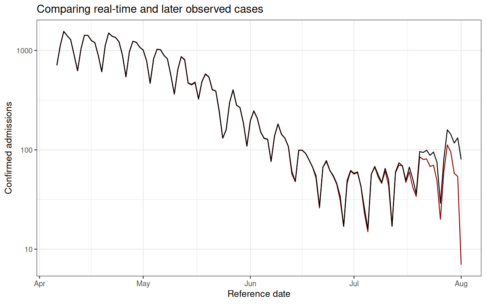
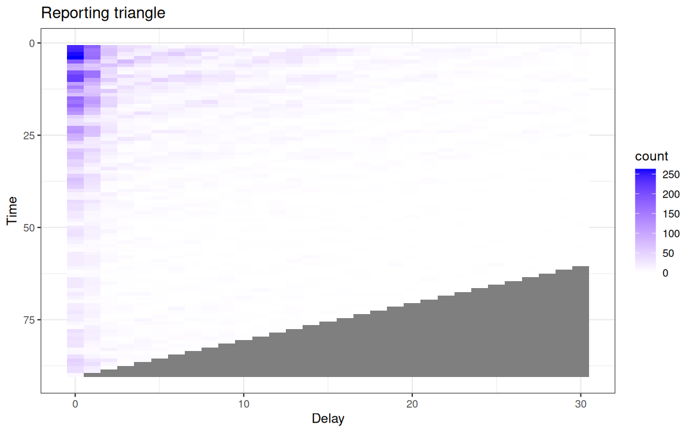
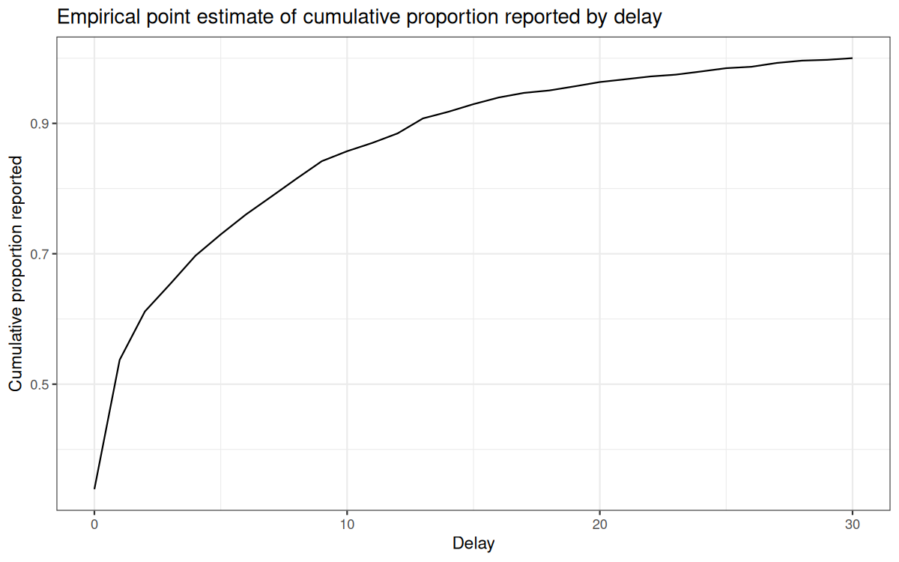
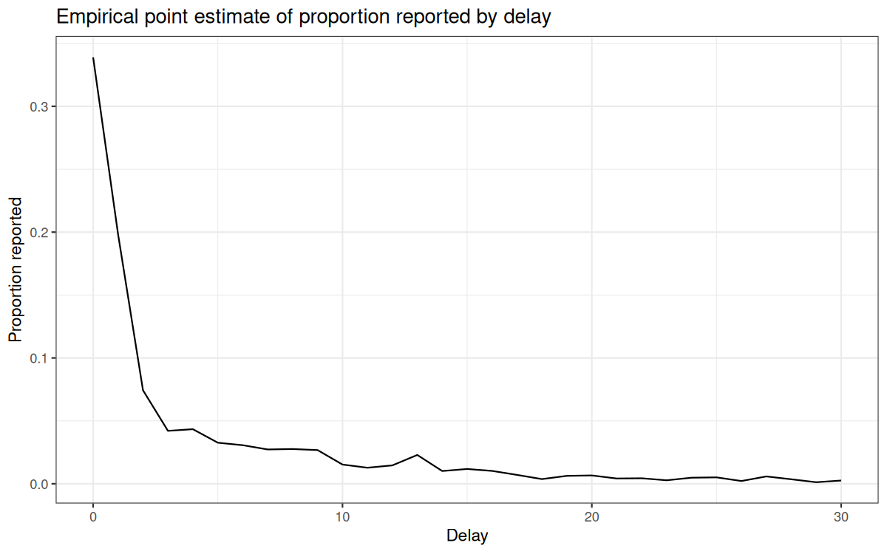
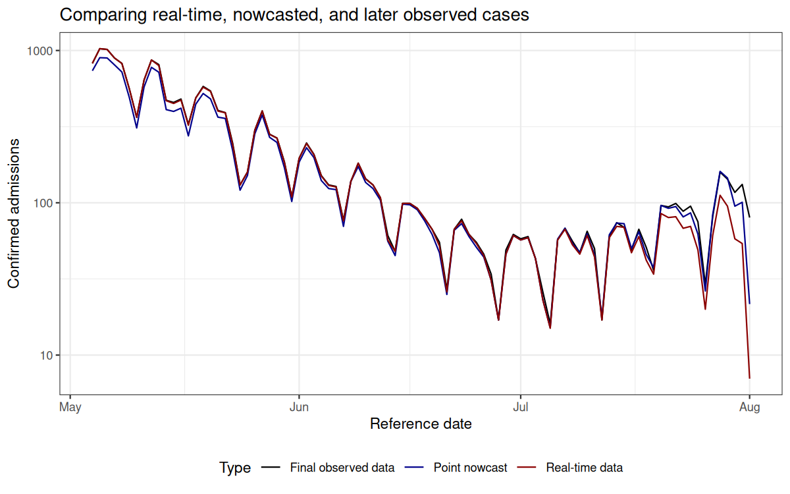
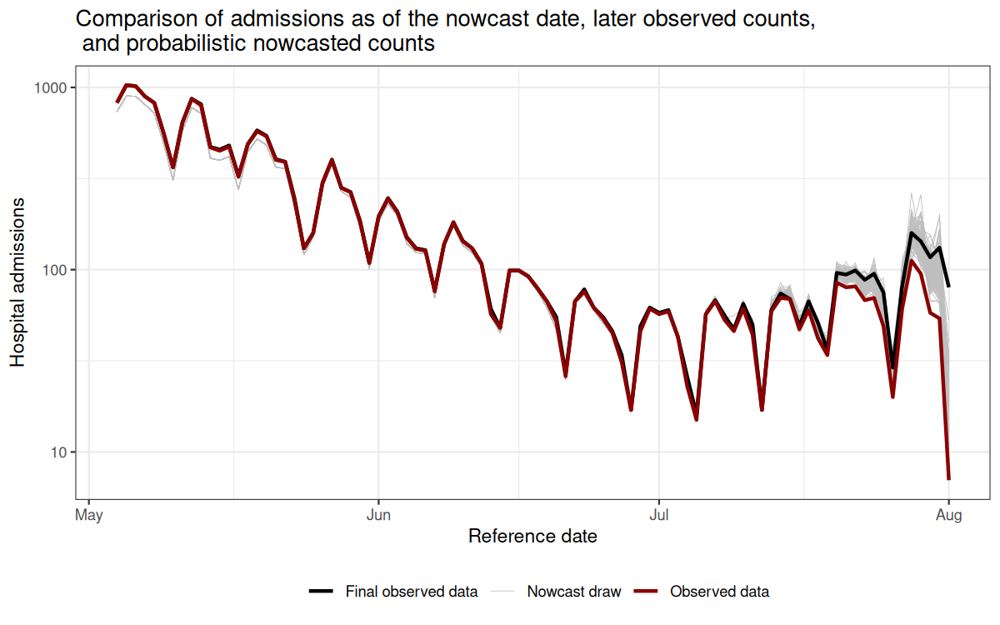

# Introduction

Incomplete reporting of epidemiological data at recent times can result in case count data that is right-truncated.
Right-truncated case counts can be misleading to interpret at face-value, as they will typically show a decline in the number of reported observations in the most recent time points.
These are the time points where the highest proportion of the data has yet to be observed in the dataset.

The imputation of the cases that will eventually be observed up until the current time is referred to as a nowcast.

A number of methods have been developed to nowcast epidemiological case count data.

The purpose of `baselinenowcast` is to provide a nowcast computed directly from the most recent observations to estimate a delay distribution empirically, and apply that to the partially observed data to generate a nowcast.

In the below section, we will describe an example of a nowcasting problem, and demonstrate how to use `baselinenowcast` to estimate a delay distribution from the data and apply that estimate to generate a probabilistic nowcast.
This example will walk through the low-level functionality of the "default" model permutation.
In future vignettes, we will demonstrate examples of how to create more complex model permutations.
More details on the mathematical methods are provided in the [mathematical model](model_definition.html) vignette.

# Packages

As well as the `baselinenowcast` package this vignette also uses `epinowcast`,`ggplot2`, `tidyr`, and `dplyr`.
The installation of `epinowcast` is not required for using the package.
however, its pre and post-processing functions provide a lot of the data wrangling needed to set up the nowcasting problem.
We note that we will just be using components of `epinowcast`, which can be installed using the following:

``` r
# nolint start
# Installing epinowcast
# install.packages(
#  "epinowcast", repos = "https://epinowcast.r-universe.dev"
# ) #nolint
# nolint end
# Load packages
library(baselinenowcast)
library(epinowcast)
library(ggplot2)
library(dplyr)
library(tidyr)
# Set seed for reproducibility
set.seed(123)
```

# Data

Nowcasting of right-truncated case counts involves the estimation of reporting delays for recently reported data.
For this, we need case counts indexed both by when they were diagnosed (often called the "reference date") and by when they were reported (i.e. when administratively recorded via public health surveillance; often called "report date").
The difference between the reference date and the report date is the reporting delay.
For this quick start, we use daily level data from the [Robert Koch Institute via the Germany Nowcasting hub](https://github.com/KITmetricslab/hospitalization-nowcast-hub/wiki/Truth-data#role-an-definition-of-the-seven-day-hospitalization-incidence).
These data represent hospital admission counts by date of positive test and date of test report in Germany up to October 1, 2021.

We will filter the data to just look at the national-level data, for all age groups.
We will pretend that we are making a nowcast as of August 1, 2021, therefore we will exclude all reference dates and report dates from before that date.
`germany_covid19_hosp` is provided as package data from `epinowcast`.
Let's start by plotting the sum of the reports at each reference date, and then compare that to what we will eventually observe as of the latest date in the complete dataset (data available through October 1, 2021).

``` r
nowcast_date <- "2021-08-01"
eval_date <- "2021-10-01"

target_data <- germany_covid19_hosp[location == "DE"][age_group == "00+"] |>
  enw_filter_report_dates(latest_date = eval_date) |>
  enw_filter_reference_dates(
    latest_date = nowcast_date
  )
```

The `epinowcast` function `enw_latest_data()` will be used to filter observations to the latest available reported total counts for each reference date.

``` r
latest_data <- enw_latest_data(target_data)
```

The `epinowcast` function `enw_filter_report_dates()` will be used to create a truncated dataset for generating a retrospective nowcast, using the data that would have been available as of the nowcast date.

``` r
observed_data <- enw_filter_report_dates(
  target_data,
  latest_date = nowcast_date
)

head(observed_data)
#>    reference_date location age_group confirm report_date
#>            <IDat>   <fctr>    <fctr>   <int>      <IDat>
#> 1:     2021-04-06       DE       00+     149  2021-04-06
#> 2:     2021-04-07       DE       00+     312  2021-04-07
#> 3:     2021-04-08       DE       00+     424  2021-04-08
#> 4:     2021-04-09       DE       00+     288  2021-04-09
#> 5:     2021-04-10       DE       00+     273  2021-04-10
#> 6:     2021-04-11       DE       00+     107  2021-04-11
```

Using the observed data as of the nowcast date (`observed_data`) and the `enw_latest_data()` function, we will make a plot of the latest total number of confirmed cases at each reference date.

```{.r .fold-hide}
obs_data_by_reference_date <- enw_latest_data(observed_data)
ggplot() +
  geom_line(
    data = obs_data_by_reference_date,
    aes(x = reference_date, y = confirm), color = "darkred"
  ) +
  geom_line(
    data = latest_data,
    aes(x = reference_date, y = confirm), color = "black"
  ) +
  theme_bw() +
  xlab("Reference date") +
  ylab("Confirmed admissions") +
  scale_y_continuous(trans = "log10") +
  ggtitle("Comparing real-time and later observed cases")
```

<div class="figure" style="text-align: center">

<p class="caption">plot of chunk plot-data</p>
</div>

The red line shows the total number of confirmed admissions on each reference date, across all delays, using the data available as of August 1, 2021.
It demonstrates the characteristic behaviour of right-truncation.
This is because we have not yet observed the data with longer delays at recent time points.
The black line shows the total number of confirmed admissions on each reference date as of October 1, 2021.

Our task will be to estimate, from the data available up until August 1, 2021, the "final" total number of cases at each reference date.

# Pre-processing

In order to compute a nowcast for this data, we will need to start by creating what we call a reporting triangle.
See the [nomenclature](nomenclature.html) vignette for more details on the structure and naming of different components used in the package.

The entries in the reporting triangle represent the number of new cases assigned to that reference time point with a particular delay, with entries in the bottom right of the triangle missing as the data reported with longer delays has yet to be observed for recent reference times.
The reporting triangle will be used to estimate the delay distribution, or the proportion of the final number of cases reported on a particular delay.

In this example, we will both fit our delay distribution, and apply it to generate a nowcast matrix using the same data, the national level data from Germany for all age groups.

We recommend choosing the maximum delay and number of historical observations based on an exploratory data analysis, as these specifications will change significantly depending on the dataset.

Empirical data outside this delay window will not be used for training.

``` r
max_delay <- 30
```

We will use 3 times the maximum delay for the total training volume.

``` r
n_training_volume <- 3 * max_delay
```

We'll use the most recent 50% of the reference times for delay estimation.

``` r
n_history_delay <- as.integer(0.5 * n_training_volume)
```

For uncertainty estimation, we will generate retrospective nowcast datasets with the most recent 50% of the reference times.

``` r
n_retrospective_nowcasts <- as.integer(0.5 * n_training_volume)
```
This means that in order to estimate the delay using the same amount of data, the oldest retrospective nowcast dataset will use the first 50% of the reference times.
Note this uses the most recent observations.

Next we will use the `epinowcast` function, `enw_filter_reference_dates()` to filter to only include `n_training_volume` days of historical data.

``` r
training_data <- enw_filter_reference_dates(
  observed_data,
  include_days = n_training_volume - 1
)
```

The `epinowcast` function `enw_latest_data()` will be used to filter for the latest available reported total counts for each reference date.

``` r
latest_training_data <- enw_latest_data(training_data)
```

To obtain the data we want to evaluate the forecasts against, we will use `enw_filter_reference_dates()` applied to the `target_data`, to filter it for only the `n_training_volume` days of historical data.

``` r
eval_data <- enw_filter_reference_dates(
  latest_data,
  include_days = n_training_volume - 1
)
```

Next we obtain the reporting triangle, adding an additional day to the `max_delay` because we want the `max_delay + 1` entries since 0 is a valid delay.
This also validates that the data is in the correct format and runs preprocessing see `enw_preprocess_data()` for more details.

``` r
pobs <- enw_preprocess_data(
  obs = training_data,
  max_delay = max_delay + 1
)
```

Extract components from `pobs`, which is an `epinowcast` object.
We only have one group here so we only need `reference_date`, `delay`, and `new_confirm`.

``` r
reporting_triangle_df <- select(
  pobs$new_confirm[[1]],
  reference_date,
  delay,
  new_confirm
)
```

We now pivot to wide format, dropping the `reference_date` column, and convert to a matrix this is the format that the low-level functions in `baselinenowcast` expect.

``` r
reporting_triangle <- reporting_triangle_df |>
  pivot_wider(names_from = delay, values_from = new_confirm) |>
  select(-reference_date) |>
  as.matrix()
```


```{.r .fold-hide}
triangle_df <- as.data.frame(reporting_triangle) |>
  mutate(time = row_number()) |>
  pivot_longer(!time,
    values_to = "count",
    names_prefix = "V",
    names_to = "delay"
  ) |>
  mutate(delay = as.numeric(delay))

ggplot(
  triangle_df,
  aes(x = delay, y = time, fill = count)
) +
  geom_tile() +
  scale_fill_gradient(low = "white", high = "blue") +
  labs(title = "Reporting triangle", x = "Delay", y = "Time") +
  theme_bw() +
  scale_y_reverse()
```

<div class="figure" style="text-align: center">

<p class="caption">plot of chunk make-heatmap-reporting-triangle</p>
</div>

Here, the grey indicates matrix elements that are `NA`, which we would expect to be the case in the bottom right portion of the reporting triangle where the counts have yet to be observed.

# Estimate delay

Now that we have the reporting triangle, we are now ready to pass it in to the `baselinenowcast` package to estimate the delay distribution.
We will tell the function the maximum delay and the number of observations we want to use for estimation.
We only want to pass in the reporting triangle (for a single group!) to this function.
See documentation for `estimate_delay()` for a full description of the function inputs.

``` r
delay_pmf <- estimate_delay(
  reporting_triangle = reporting_triangle,
  max_delay = max_delay,
  n = n_history_delay
)
```

```{.r .fold-hide}
delay_df <- data.frame(
  delay = 0:(length(delay_pmf) - 1),
  pmf = delay_pmf
)

ggplot(delay_df) +
  geom_line(aes(x = delay, y = cumsum(pmf))) +
  xlab("Delay") +
  ylab("Cumulative proportion reported") +
  ggtitle("Empirical point estimate of cumulative proportion reported by delay") + # nolint
  theme_bw()
```

<div class="figure" style="text-align: center">

<p class="caption">plot of chunk plot-delay</p>
</div>

```{.r .fold-hide}

ggplot(delay_df) +
  geom_line(aes(x = delay, y = pmf)) +
  xlab("Delay") +
  ylab("Proportion reported") +
  ggtitle("Empirical point estimate of proportion reported by delay") +
  theme_bw()
```

<div class="figure" style="text-align: center">

<p class="caption">plot of chunk plot-delay</p>
</div>

# Apply the delay to generate a point nowcast

The next step in our workflow is to take the estimated delay distribution and apply it to the partially observed reporting triangle, generating an estimate of the number of new cases confirmed at each reference date and delay.
This will generate a point estimate of complete the reporting matrix.
In this case, we will be applying the delay to the same reporting triangle we used to generate the estimate, but this doesn't always have to be the case.
See the documentation for `apply_delay()` for a full description of the input requirements.

It is worth noting that we could also have estimated the delay and applied it in one single step by calling `generate_pt_nowcast_mat()`.
In subsequent steps to estimate the uncertainty, both delay estimation and generating a point nowcast matrix happen in a single step.

``` r
point_nowcast_matrix <- apply_delay(
  rep_tri_to_nowcast = reporting_triangle,
  delay_pmf = delay_pmf
)
```

We'll make a quick plot to compare our point estimate of the nowcasted confirmed cases through August 1, 2021, to the "final" observations from October 1, 2021 and to the right-truncated data available up until August 1, 2021.


```{.r .fold-hide}
point_nowcast_df <- eval_data |>
  mutate(nowcast = rowSums(point_nowcast_matrix))

prep_latest_data <- latest_training_data |>
  mutate(type = "Real-time data") |>
  select(type, reference_date, count = confirm)
# Combine data into a single dataframe for plotting
plot_data <- point_nowcast_df |>
  pivot_longer(
    cols = c(confirm, nowcast),
    names_to = "type",
    values_to = "count"
  ) |>
  mutate(type = case_when(
    type == "confirm" ~ "Final observed data",
    type == "nowcast" ~ "Point nowcast",
    TRUE ~ type
  )) |>
  bind_rows(prep_latest_data)

# Create plot with data type as a variable
ggplot(plot_data, aes(x = reference_date, y = count, color = type)) +
  geom_line() +
  scale_color_manual(values = c(
    "Real-time data" = "darkred",
    "Final observed data" = "black",
    "Point nowcast" = "darkblue"
  )) +
  theme_bw() +
  xlab("Reference date") +
  ylab("Confirmed admissions") +
  scale_y_continuous(trans = "log10") +
  ggtitle("Comparing real-time, nowcasted, and later observed cases") +
  theme(legend.position = "bottom") +
  labs(color = "Type")
```

<div class="figure" style="text-align: center">

<p class="caption">plot of chunk unnamed-chunk-1</p>
</div>

Here we can see that our point nowcast (blue) slightly underestimates what was eventually reported (black), but does a decent overall job of correcting for the right-truncation observed in the the data as of the nowcast date (red).

# Estimate uncertainty

So far, we've demonstrated how to generate a point estimate of a nowcast.
We would like to generate probabilistic nowcasts.

The method used to estimate the uncertainty works by generating retrospective reporting triangles using what would have been available as of each retrospective nowcast time to estimate a delay distribution, generate a point nowcast matrix, and compare the estimated counts at each reference time to those that have been observed at each nowcast horizon.
It assumes that the observations follow a negative binomial observation model, and independently estimates the dispersion in the negative binomial at each forecast horizon.

We repeat this process for `n_retrospective_nowcasts` reference times in the current reporting triangle, starting from the latest reference time and working backwards, ultimately using all `n_retrospective_nowcasts` and `n_history_delay` reference times.


``` r
trunc_rep_tri_list <- truncate_triangles(reporting_triangle,
  n = n_retrospective_nowcasts
)
retro_rep_tri_list <- generate_triangles(trunc_rep_tri_list)
```
This results in a list of retrospective reporting triangles.
See the documentation for `truncate_triangles()` and `generate_triangles()` for more information on the inputs and outputs of these functions.

Next we will pass this list of reporting triangles to the `generate_pt_nowcast_mat_list()` and specify `n`, the number of reference times to be used to estimate the delay for each nowcast, which we will set as the `n_history_delay` previous specified.


``` r
retro_pt_nowcast_mat_list <- generate_pt_nowcast_mat_list(
  reporting_triangle_list = retro_rep_tri_list,
  n = n_history_delay
)
```

Next, we will use the retrospective reporting triangles, the point nowcast matrices, and the truncated reporting triangles to estimate the uncertainty at each horizon, starting at horizon 0 using the `estimate_uncertainty()` function.


``` r
disp_params <- estimate_uncertainty(
  pt_nowcast_mat_list = retro_pt_nowcast_mat_list,
  trunc_rep_tri_list = trunc_rep_tri_list,
  reporting_triangle_list = retro_rep_tri_list,
  n = n_retrospective_nowcasts
)
```

# Generate probabilistic nowcast

Now that we have estimated the dispersion, we can generate a probabilistic nowcast using the `sample_nowcasts()` function which:

- generates draws from the nowcast distribution
- combines the draws with the observed data to form a single draw of the nowcast
- repeats this process for `draws` draws


``` r
nowcast_draws_df <- sample_nowcasts(
  point_nowcast_matrix, reporting_triangle,
  dispersion = disp_params,
  draws = 100
)

head(nowcast_draws_df)
#>   pred_count time draw
#> 1        736    1    1
#> 2        897    2    1
#> 3        893    3    1
#> 4        804    4    1
#> 5        722    5    1
#> 6        492    6    1
```

See documentation for `sample_nowcasts()`for further details.

# Visualizing the nowcast

Let's visualize the nowcast compared to the final observed data.
We first need to join our nowcast with the original data so we can see our nowcast by reference date.

Prepare the data as of the nowcast date, `latest_training_data` so that we can map the nowcast draws onto it.

``` r
latest_data_prepped <- latest_training_data |>
  mutate(time = row_number()) |>
  rename(obs_confirm = confirm) |>
  mutate(reference_date = as.Date(reference_date))
```

Prepare the final evaluation data so we can combine the datasets.

``` r
final_data_prepped <- eval_data |>
  select(reference_date, final_confirm = confirm) |>
  mutate(reference_date = as.Date(reference_date))
```

Join the nowcasts, data as of the nowcast date, and the final data.

``` r
obs_with_nowcast_draws_df <- nowcast_draws_df |>
  left_join(latest_data_prepped, by = "time") |>
  left_join(final_data_prepped, by = "reference_date")
head(obs_with_nowcast_draws_df)
#>   pred_count time draw reference_date location age_group obs_confirm
#> 1        736    1    1     2021-05-04       DE       00+         823
#> 2        897    2    1     2021-05-05       DE       00+        1028
#> 3        893    3    1     2021-05-06       DE       00+        1016
#> 4        804    4    1     2021-05-07       DE       00+         892
#> 5        722    5    1     2021-05-08       DE       00+         822
#> 6        492    6    1     2021-05-09       DE       00+         561
#>   report_date final_confirm
#> 1  2021-07-24           823
#> 2  2021-07-25          1028
#> 3  2021-07-26          1016
#> 4  2021-07-27           892
#> 5  2021-07-28           822
#> 6  2021-07-29           561
```

Create a separate dataframe for only the observed and final data, to make plotting easier.

``` r
combined_data <- obs_with_nowcast_draws_df |>
  select(reference_date, obs_confirm, final_confirm) |>
  distinct() |>
  pivot_longer(
    cols = c(obs_confirm, final_confirm),
    names_to = "type",
    values_to = "count"
  ) |>
  mutate(type = case_when(
    type == "obs_confirm" ~ "Observed data",
    type == "final_confirm" ~ "Final observed data"
  ))
```

```{.r .fold-hide}
# Plot with draws for nowcast only
ggplot() +
  # Add nowcast draws as thin gray lines
  geom_line(
    data = obs_with_nowcast_draws_df,
    aes(
      x = reference_date, y = pred_count, group = draw,
      color = "Nowcast draw", linewidth = "Nowcast draw"
    )
  ) +
  # Add observed data and final data once
  geom_line(
    data = combined_data,
    aes(
      x = reference_date,
      y = count,
      color = type,
      linewidth = type
    )
  ) +
  theme_bw() +
  scale_color_manual(
    values = c(
      "Nowcast draw" = "gray",
      "Observed data" = "darkred",
      "Final observed data" = "black"
    ),
    name = ""
  ) +
  scale_linewidth_manual(
    values = c(
      "Nowcast draw" = 0.2,
      "Observed data" = 1,
      "Final observed data" = 1
    ),
    name = ""
  ) +
  scale_y_continuous(trans = "log10") +
  xlab("Reference date") +
  ylab("Hospital admissions") +
  theme(legend.position = "bottom") +
  ggtitle("Comparison of admissions as of the nowcast date, later observed counts, \n and probabilistic nowcasted counts") # nolint
```

<div class="figure" style="text-align: center">

<p class="caption">plot of chunk plot-probablistic-nowcasts</p>
</div>

Gray lines indicate the probabilistic nowcast draws, which are a combination of the already observed data at each reference date and the predicted nowcast draws at each reference date.
Black lines show the "final" data from October 1, 2021.
