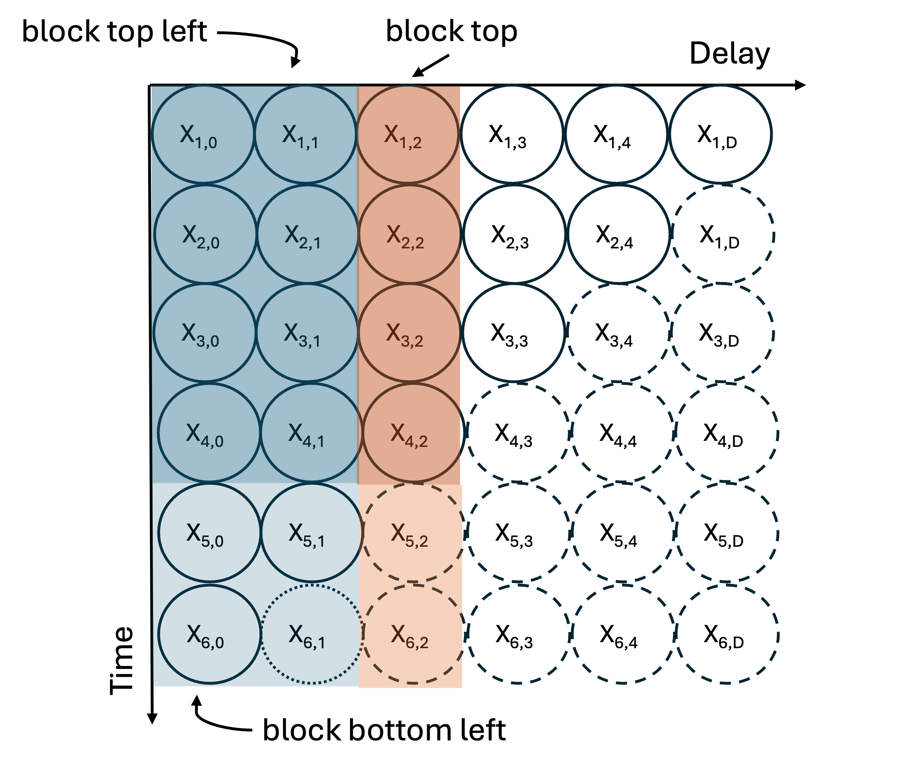

# Overview

The method to generate nowcasts use a multiplicative model.
This multiplicative model works by iteratively "filling in" the reporting triangle starting from the bottom left, and moving column by column from left to right until the bottom right of the triangle is filled in.

Figure 1. Schematic figure demonstrating the iterative generation of nowcasts from a reporting triangle. In this case, the values being estimated are $x_{t=6, d = 2}$ and $x_{t=5, d= 2}$ assuming that we have already iteratively estimated $x_{t=6, d= 1}$. The dotted dashed lines around observations $x_{t,d}$ indicated estimates that have been imputed, the dashed lines indicates observations $x_{t,d}$ that have not yet been observed or imputed, and the solid lines indicate observations that have been observed.

The method requires at least one observation, at delay $d=0$ for the most recent reference date, located at the bottom of the reporting triangle in Fig 1 above. The method assumes that the values at each delay $d$ column will be the same proportion of the values previously reported. To fill in the missing values for each column $d$, we sum over the rectangle of completely observed reference dates for all $d-1$ columns (block top left) and sum over the column of completely observed reference dates for all of the entries in column $d$ (block left). The ratio of these two sums is assumed to be the same in the missing entries in column $d$, so we use the entries observed up to $d-1$ for each incomplete reference date (block bottom left), and scale by this ratio to get the missing entries in column $d$. This process is repeated for each delay from $d$ to the maximum delay $D$. At each iteration an additional reference date entry is computed as the delay $d$ increases.

# Mathematical model

The following describes the estimate of the delay distribution, the generation of the point nowcast, and the estimate of the observation error, for a partially observed or complete reporting triangle.
The method itself is time-unit agnostic, which means it can be used to generate nowcasts for any temporal granularity in the reporting and reference of data.
In the case where the temporal granularity of the reporting differs from the referencing, e.g.
weekly releases of daily data, pre-processing will need to be done so that the units of the delays $d$ and the units of the reference time $t$ are the same (e.g. by filling in 0s for all the days of the week that no data is reported).
This method is based on the method described by [Wolffram et al. 2023](https://journals.plos.org/ploscompbiol/article?id=10.1371/journal.pcbi.1011394).

## Notation

We denote $X_{t,d}, d = 0, .., D$ as the number of cases occurring on time $t$ which appear in the dataset with a delay of $d$. For example, a delay $d = 0$ means that a case occurring on day $t$ arrived in the dataset on day $t$, or on what is considered to be the first possible report date in practice. We only consider cases reporting within a maximum delay $D$. The number of cases reporting for time $t$ with a delay of at most $d$ can be written as:

$$X_{t, \le d} = \sum_{i=0}^d X_{t,i} $$

Such that $X_t = X_{t, \le D}$ is the “final” number of reported cases on time $t$. Conversely, for $d < D$

$$X_{t,>d} = \sum_{i = d+1} ^{D} X_{t,i}$$

is the number of cases still missing after $d$ delay.
We refer to $X_t$ to describe a random variable, $x_t$ for the corresponding observation, and $\hat{x}_t$ for an estimated/imputed value.
We refer to the matrix of $x$ available at a given data release time $t^*$ , as the reporting triangle. Here, all $t+d>t^*$ have yet to be observed.

|   | $d = 0$ | $d = 1$ | $d=2$ | $...$ | $d= D-1$ | $d= D$ |
|-----------|-----------|-----------|-----------|-----------|-----------|-----------|
| $t=1$ | $x_{1,0}$ | $x_{1,1}$ | $x_{1,2}$ | $...$ | $x_{1,D-1}$ | $x_{1, D}$ |
| $t=2$ | $x_{2,0}$ | $x_{2,1}$ | $x_{2,2}$ | $...$ | $x_{2,D-1}$ | $x_{2, D}$ |
| $t=3$ | $x_{3,0}$ | $x_{3,1}$ | $x_{3,2}$ | $...$ | $x_{3,D-1}$ | $x_{3, D}$ |
| $...$ | $...$ | $...$ | $...$ | $...$ | $...$ | $...$ |
| $t=t^*-1$ | $x_{t^*-1,0}$ | $x_{t^*-1,1}$ | $x_{t^*-1,,2}$ | $...$ | $x_{t^*-1,,D-1}$ | $x_{t^*-1,D}$ |
| $t=t^*$ | $x_{t^*,0}$ | $x_{t^*,1}$ | $x_{t^*,2}$ | $...$ | $x_{t^*,D-1}$ | $x_{t^*, D}$ |

## Point estimate of the delay distribution

We use the entire reporting triangle to compute an empirical estimate of the delay distribution, $\pi(d)$.
Another way to think about this as a probability distribution describing the probability that a case incident at reference time $t$ appears in the dataset with delay $d$ (so at time $t + d$). We refer to the realized empirical estimate of the delay distribution from a reporting triangle as $\pi(d)$.
The delay distribution, $\pi(d)$ can be estimated directly from the completed reporting matrix $X$

$$
\pi(d)= \frac{\sum_{t=1}^{t=t^*} X_{t,d}}{\sum_{d=0}^{D} \sum_{t=1}^{t=t^*} X_{t,d}}
$$

Where the numerator is the sum of all the observations across reference times $t$ for a particular delay $d$, and the denominator is the sum across all reference times $t$ and delays $d$.

In the special case when the reporting triangle is fully observed, i.e. the time the estimate is made, $t'$, is greater than the data release time plus the maximum delay ($t' \ge t^* + D$), $\hat{\pi}_d$ can be computed directly.

## Point nowcast from incomplete reporting matrix

In the case where there are partial observations, in order to properly weight the denominator with the missing delays, we have to first impute the cases $\hat{x}_{t,d}$ for all instances where $t+d > t^*$. This amounts to computing the point nowcast from the partial reporting triangle.

To do so, we start by defining $\theta_d$, which is the factor by which the cases on delay $d$ compare to the total cases through delay $d-1$, obtained from $N$ preceding rows of the triangle. In practice, $N \ge D$, with any $N > D$ representing the number of completed observations used to inform the estimate

$$
\hat{\theta}_d(t^*) = \frac{\sum_{i=1}^{N} x_{t^*-i+d, d}}{\sum_{d=1}^{d-1} \sum_{i=1}^{N} x_{t^*-i+d,d}}
$$

This amounts to taking the sum of the elements in column $d$ up until time $t*-d$ and dividing by the sum over all the elements to the left of column $d$ up until time $t*-d$, referred to as "block top" and "block top left", respectively, in the Figure 1.

This factor is then used to compute the expected values for all the missing rows with delay $d$ as:

$$
\hat{x}_{t,d} = \hat{\theta_d}(t^*) \times \sum_{t=t^*-d}^{t^*} x_{t,d-1}
$$

This amounts to effectively taking the sum across the columns in the bottom left ("block bottom left" in the Figure 1) of the matrix up until column $d$ and multiplying by the factor to estimate the value of $x_{t,d}$ in each row.
This process is repeated iteratively, from bottom left to top right, to impute the bottom right triangle of the reporting matrix for each time $t$ and delay $d$ when $t+d>t^*$. The combination of the imputed and observed reporting matrix is then used to compute the delay distribution $\hat{\pi}(d)$ as described above.
The factor, $\theta_d$ can only be computed for delays greater than 0, which effectively means that a row of the reporting triangle without any observations, can not be imputed as the process works iteratively. Therefore, the reporting matrix must have at least an entry (though it can be 0) for $x_{t*,d=0}$ to compute a nowcast for $t^*$. We will describe the method for estimating nowcasts for zero-valued counts below.
The method described above uses the incomplete reporting triangle to iteratively compute a point nowcast. We can also use the delay distribution $\hat{\pi(d)}$ directly to compute a point nowcast, which can be useful if, for example, the delay distribution is estimated from different strata or as part of a separate estimate.

## Point nowcast from delay distribution $\pi(d)$

To propagate the point nowcast from the delay distribution, we need to estimate the expected total number of eventual observed cases $\hat{x}_t$, for each reference time $t$.
Let $z$ be the sum over all delays $d$ that have already been observed (up until $t^*-t$), such that $z =\sum_{d=1}^{d=t^*-t} x_{t,d}$ and $\delta$ be the cumulative sum of the delay distribution, $\pi(d)$ up until $d = t^*-t$ such that $\delta = \sum_{d=1}^{d=t^*-t} \pi(d)$.
By assuming that $z \sim Bin(x_t, \delta)$ and $x_t \sim Unif(0, \inf)$, X et al show that the expected value of $x_t$, the total number of reported cases on reference time $t$, can be written as:
<!--- Note: insert citation and more complete explanation --->
$$
E(x_t | z, \delta) = \hat{x}_t = \frac{z + 1 - \delta}{\delta}
$$

Then we can compute $\hat{x}_{t,d}$ directly using the $d$th element of $\pi(d)$

$$
\hat{x}_{t,d} = \pi(d) \times \hat{x}_t
$$

Where the number of reports at timepoint $t$ with delay $d$ is the product of the the expected total reports, $x_t$ and the proportion expected at that particular delay $d$, $\pi(d)$.

## Estimate of uncertainty in the nowcast

To extend these point nowcasts to probabilistic nowcasts, we use the past nowcast errors.
We describe a method which generates retrospective reporting triangles to replicate what would have been available as of time $t^*=s^*$.

The method uses each retrospective incomplete reporting triangle to re-estimate a delay distribution using the $N$ preceding rows of the reporting triangle before $s^*$, and recomputes a retrospective nowcast, for $M$ realizations of the retrospective reporting triangle (so $M$ different $s^*$ values).

For each horizon $d = 1, ..., D$ we assume that the observed values, $X_{s^*-d, >d}$ follow a negative binomial observation model with a mean of $\hat{x}_{s^*-d}$:

$$
X_{s^*-d,>d} | \hat{x}_{s^*-d, >d}(s*) \sim NegBin(\mu = \hat{x}_{s^*-d} + 0.1, \phi = \phi_d)
$$

We add a small number (0.1) to the mean to avoid an ill-defined negative binomial. We note that to perform all these computations, data snapshots from at least $N + M$ past observations, or rows of the reporting triangle, are needed. This estimate of the uncertainty accounts for the empirical uncertainty in the point estimate of the delay distribution over time.

### Generating probabilistic nowcasts

Using the dispersion parameters for each delay, $\phi(d)$ for $d = 1,...D$, we can generate probabilistic nowcasts by drawing samples from the negative binomial:

$$
X_{t,d} \sim NegBin(\mu = \hat{x}_{t,d}, \phi = \phi(d))
$$

We can sample for any number of draws, and then use the draws to compute any desired quantiles to summarize the outputs.
